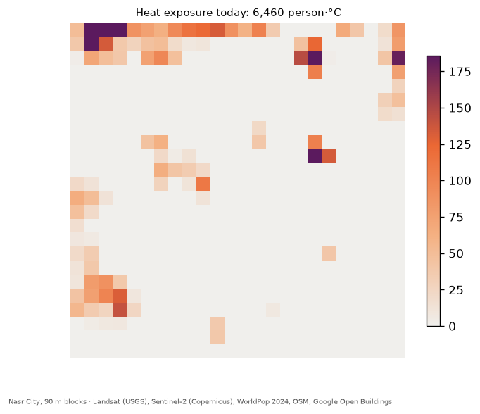

# CoolCairo

**Block-level urban heat decision support for MENA cities, starting with Nasr City, Cairo.**
Arab Youth Space Hackathon 2026 (UAE Space Agency / Space42), 813 Challenge: *Urban Expansion, Land Use Change & Heat Risk*. Team 46.

> We want to **map** summer heat risk (land surface temperature, the surface materials driving it, and the residents exposed to it) in **fast-growing cities across the Middle East and North Africa**, starting with **Nasr City, Cairo** (June–August 2023–2025) as the first example, so that **city planners** can **decide which blocks to prioritise for cool roofs, street trees, cool pavements and pocket parks**.

Cities across the region share the problem: desert climate, dark roofs and asphalt, sandy lots, and fast growth onto the desert. Every dataset used here is free and covers the whole region, so the method runs in any city; Nasr City is the first one built and tested.

CoolCairo is a Windows desktop app backed by a reproducible Python analysis. A planner sees the district in 3D from real satellite data, switches between surface materials, surface temperature and heat risk, paints cooling measures onto 90 m blocks, and reads the predicted effect live.

**Methodology report:** [`docs/CoolCairo_Methodology_Report.pdf`](docs/CoolCairo_Methodology_Report.pdf) (data, method, validation, results, limitations). **Quick look without installing anything:** [example data and results](#example-data-try-it-in-seconds-offline).

## What the app does

1. **Satellite archive sync.** At start-up the app queries the real archives for the exact scenes the analysis used (65 Landsat 8/9 scenes and 70 Sentinel-2 granules from 58 acquisition days via Microsoft Planetary Computer, the EnMAP scene via DLR) and downloads a live preview of Cairo from each satellite. Offline, it says so and uses the prepared data.
2. **MENA globe.** NASA Blue Marble Earth with the region's major cities; Nasr City is the one analysed district, the others show where the method scales next.
3. **Fly-in.** From space down to Nasr City, ending on a sharp 10 m Sentinel-2 image of Cairo.
4. **3D district** (about 1,900 buildings with estimated heights) with four views:
   - **Materials:** vegetation, dark surfaces, pale surfaces and bare sand per block.
   - **Surface heat:** summer land surface temperature per block.
   - **Heat risk:** residents × degrees above a typical east-Cairo block.
   - **Growth:** building cover 2016 → 2023 per block: new built-up, denser, unchanged, still open.
5. **Analysis maps.** Each view opens the matching figures from the methodology report (e.g. the hyperspectral comparison in Surface heat); the heat view offers three colour schemes.
6. **Four cooling tools**, painted per block, with live results (average block temperature before → after, heat exposure, residents in cooled blocks):

| Tool | What it changes | Effect per unit of block area | Basis |
| --- | --- | --- | --- |
| Cool roofs | Dark and pale roofs coated white | −4.6 °C (dark) / −3.6 °C (pale) | Published values |
| Street trees | Up to 25% of dark ground planted | −3.3 °C | Our regression |
| Cool pavements | Asphalt coated reflective (albedo 0.12 → 0.40) | −2.2 °C | Published values (conservative) |
| Pocket parks | Up to 50% of bare sand greened | −6.5 °C | Our regression |

## Key results

- **Heat model:** block surface temperature from material fractions and building height, spatial cross-validated R² **0.25** (mean error ±1.2 °C, 2,538 urban blocks, 1 km tiles held out).
- **Hyperspectral adds value for heat:** with our features, EnMAP block spectra explain block surface temperature at R² **0.58** vs **0.40** with Sentinel-2. Spectra alone: **0.53** for EnMAP's full spectrum vs **0.33** for the same scene reduced to Sentinel-2's bands, so the gain comes from spectral detail, not the sensor or date. The advantage holds with 2–3 km held-out tiles. For separating buildings from desert, EnMAP adds nothing beyond the Sentinel-2 summer composite (58 acquisition days). See `analysis/notebooks/05_hyperspectral_value.ipynb`.
- **Heat risk in the display district:** 95,141 residents, 6,460 person·°C of heat exposure today. At full adoption within each tool's limits, exposure falls by 41% (cool roofs), 24% (street trees), 52% (cool pavements) and 60% (pocket parks). Targeting matters more: cool roofs and pocket parks on only the riskiest third of blocks cut it by **74%** (6,460 → 1,686 person·°C, 22,588 residents in cooled blocks).
- **Urban growth 2016–2023:** building footprint area in east Cairo grew 5.7% (37.1 → 39.2 km²); 988 blocks turned from open land to built-up and now house about 61,000 residents. These new blocks average 46.9 °C summer surface temperature, about 1 °C hotter than established neighbourhoods (46.0 °C) and cooler than open desert (48.6 °C). See `analysis/notebooks/06_urban_growth.ipynb`.
- **Building heights:** Google Open Buildings 2.5D estimates checked against OSM-tagged heights: bias −1.4 m, mean error 6.2 m, r = 0.60.

## Data

| Source | Use | Licence / attribution |
| --- | --- | --- |
| Landsat 8/9 Collection 2 Level-2 (USGS, via Planetary Computer) | Surface temperature, summer median 2023–2025 | Public domain (USGS) |
| Sentinel-2 L2A (ESA Copernicus, via Planetary Computer) | Surface materials, vegetation, fly-in image | Contains modified Copernicus Sentinel data [2023–2025] |
| EnMAP L2A, 22 Apr 2025 (DLR EOC Geoservice) | Hyperspectral heat drivers | Contains modified EnMAP data © DLR [2025]. Raw data may not be redistributed and is **not** in this repository |
| OpenStreetMap (via osmnx) | Building footprints | © OpenStreetMap contributors, ODbL |
| Google Open Buildings 2.5D Temporal (2016–2023) | Building heights, urban growth | CC BY 4.0 / ODbL |
| WorldPop Global2 R2025A, 2024 | Residents per block | CC BY 4.0 |
| NASA Blue Marble (July 2004) | Globe texture | Public domain |

Intervention effects, costs researched for later, and all sources: `docs/intervention_research.md`.

## Reproduce

**Analysis** (Python 3.12 via [uv](https://docs.astral.sh/uv/)):

```bash
cd analysis
uv sync                        # locked dependencies
uv run pytest                  # unit tests
uv run python run_pipeline.py  # stream data, fit model, write export/district.json
uv run jupyter lab             # notebooks 00–06 (00 runs offline in seconds; 01–06 stream the data)
uv run python report/build_report.py  # methodology report PDF in docs/ (needs the EnMAP files)
uv run python globe_textures.py       # app globe textures from NASA Blue Marble (already in the repo)
```

Without uv, `requirements.txt` at the repo root pins the same versions (Python 3.12): `pip install -r requirements.txt`, then `pip install --no-deps -e ./analysis`, then run the same commands with `python` instead of `uv run python`. With conda or mamba: `conda env create -f environment.yml`, then `conda activate coolcairo` (same pinned versions).

No account or API key is needed for the core pipeline. **EnMAP is optional:** it needs a free DLR EOC Geoservice account subscribed to the "EnMAP Access Service"; download the files for the scene in `analysis/config/enmap_scenes.txt` into `analysis/data/enmap/`. Without them the pipeline, notebooks 01–04 and 06 and the example run, and skip the hyperspectral results; only notebook 05 and the report script need them.

### Example data: try it in seconds, offline

[`data/sample_input/`](data/sample_input/README.md) holds real example input: every 90 m block of the east-Cairo model area (material shares, building height, summer surface temperature, residents, building cover 2016/2023), plus Landsat, Sentinel-2 and building extracts for Nasr City. No download or account needed:

Open **[`analysis/notebooks/00_quick_example.ipynb`](analysis/notebooks/00_quick_example.ipynb)**: it runs in about 10 seconds and is saved with its outputs, so you can read the results and maps on GitHub without running anything. To rerun it, or the same steps as a script:

```bash
cd analysis
uv run jupyter lab                 # open notebooks/00_quick_example.ipynb, Restart Kernel and Run All
uv run python run_example.py       # same steps as a script; or: python run_example.py
```

It fits the heat model and computes cooling effects, heat risk and urban growth, writing [`results/`](results/summary.md) (JSON, CSV, three maps and a summary). The numbers match the report and the app; `uv run pytest` checks that.

| Result (from the example data) | Value |
| --- | --- |
| Heat model, spatial cross-validated R² | 0.25 (±1.2 °C, 2,538 blocks) |
| Nasr City heat exposure today | 6,460 person·°C (95,141 residents) |
| One measure in every block | cool roofs −41%, street trees −24%, cool pavements −52%, pocket parks −60% |
| Cool roofs + pocket parks on the riskiest third of blocks | −74% (6,460 → 1,686 person·°C) |
| Urban growth 2016–2023 | +5.7% building footprint, 988 newly built blocks at 46.9 °C vs 46.0 °C established |



**App** (Unity 6000.0.83f1, URP, Windows):

1. Open `unity/` in Unity.
2. Run **CoolCairo → Setup project and scene**. It imports `export/district.json` and builds the `Intro` (globe) and `Main` (district) scenes, including the UI.
3. Run **CoolCairo → Build Windows desktop app**. Output: `unity/Builds/Windows/CoolCairo.exe`.

Starting the app with `-autotest` makes it drive itself through the whole flow in a loop, for soak testing.

`CoolCairo.exe -selftest -logFile selftest.log` runs 51 automated checks inside the built app (heat colour schemes, brush footprint and block highlight, analysis-maps popup, view fades, result cards, paint feedback, heat shimmer, data ticker, today's heat exposure) and quits with exit code 0 when all pass; each check writes a `[SelfTest] PASS/FAIL` line to the log. `-screenshots <folder>` takes the screenshots used in the report.

## Repository layout

| Path | What |
| --- | --- |
| `analysis/src/coolcairo` | Pipeline modules; notebooks are thin drivers |
| `analysis/config/aoi.yaml` | Areas, CRS, dates, thresholds and every literature value, with sources |
| `analysis/notebooks` | 00 quick example (offline, with outputs) · 01 data · 02 classification and M2 spot check · 03 model and heat risk · 04 export · 05 hyperspectral value · 06 urban growth |
| `export/district.json` | Handoff from analysis to the app |
| `data/sample_input` | Example input (see above); `analysis/make_sample.py` recreates it |
| `results` | Example outputs written by `analysis/run_example.py` |
| `unity/Assets/CoolCairo` | Globe intro, 3D district, interventions, UI |
| `docs` | Methodology report (PDF, with its figures and app screenshots), research notes, M2 spot-check sheet, EnMAP licence |

## Limitations

- **Surface, not air, temperature.** Satellites measure how hot surfaces get. Studies suggest city-wide cool roofs lower air temperature by about 0.1–0.33 °C per +0.1 roof albedo; the effect on air is smaller and spreads beyond the district.
- **Block level only (90 m).** Landsat's thermal band is 100 m, so no per-building temperatures are claimed.
- **Modest model fit** (R² 0.25 with Sentinel-2 features). Cool roofs and cool pavements therefore use published values; trees and pocket parks use our own estimates.
- **Materials come from Sentinel-2 rules.** A visual spot check of 20 random points against Google Maps satellite imagery (milestone M2) agrees at 16 of 18 judgeable points (89%); misses are dusty asphalt and dusty roofs read as sand. The check was not blind (done by an AI assistant that could see the labels); details per point in `docs/m2_spot_check.xlsx`.
- **Heat risk is a screening indicator** (heat × residents). It does not include vulnerability such as age, housing or access to cooling.
- **Costs are not yet in the app;** researched ranges are in `docs/intervention_research.md`.

## Licence

Code: [MIT](LICENSE). The data keep their own licences and attributions (see [Data](#data)); raw EnMAP data is not included.

## Team

Liquaa Mahmoud (team lead), Mohamed Esmat (technical lead), Mahmoud Abu Zaid (data & hyperspectral analyst).
